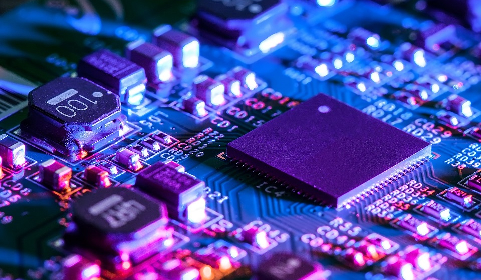
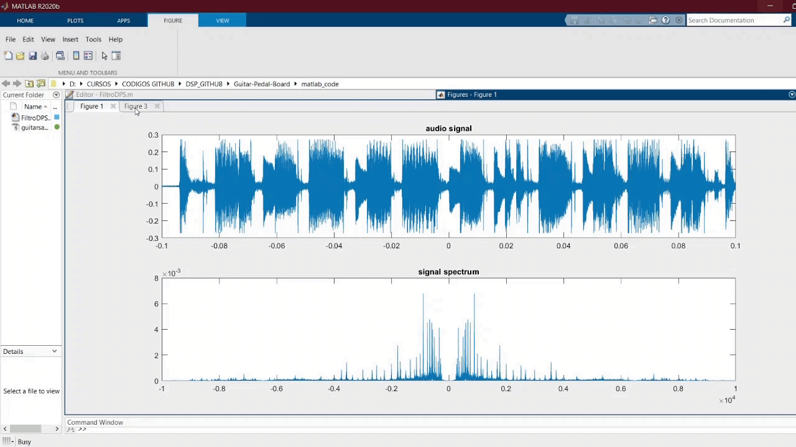

# Welcome to my Github 👋

 

## I'm a Full-Stack Engineer & Electronics Engineer Student ⚡

 

 

 

 

# My Stack

### Programming Languages

<ul > 
<li>JavaScript, TypeScript</li>
<li>Python</li>
<li>C  C++</li>
</ul>

### Tools

<ul> 
<li>Html, Css, Bootstrap, Material Ui</li>
<li>React Js, React Native, Redux</li>
<li>Node Js, Express, Sequelize</li>
<li>SQL, PostgreSQL</li>
<li>Git </li>
</ul>

 
 

# Proyects

- Videogame Showcase App
   
  

- Guitar Pedal Board
   
  

- Pong Game
   
  

 
 
Will be uploading more later!
 
 

# About Me

### Who am I?

An Electronics Engineer student from Neuquen, Argentina. Some years ago I learnt C at University and loved it! There is when i started looking for other technologies and found the software and web developer world, which totally blew my mind! Now I'm finishing last exams of my carreer and improving in new programming languages and tools every day.

### What am I interested in?

I'm a big fan of music, movies and TV show, playing guitar and piano every time I feel inspired.
Training is a habit I acquired a few years ago, which involves running and calisthenics. It's important to be in shape both mentally and fisically for a better quality of life.

### More Info

Visit my <a href="https://www.linkedin.com/in/julian-pinel/" target="_blank" rel="noreferrer" >Linkedin Here</a>
